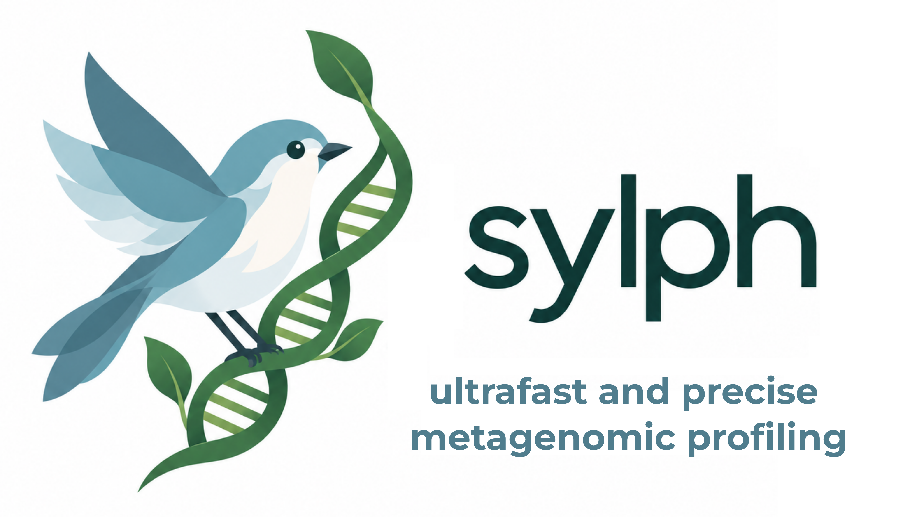

# sylph - fast and precise species-level metagenomic profiling with ANIs 

**sylph** is a tool for ultrafast taxonomic profiling of metagenomic shotgun reads. 

Sylph can profile metagenomes against ~200,000 prokaryotic species (GTDB-R232) with < 5 GB of RAM and < 30 seconds. Sylph is often > 50x faster than other methods and detects very few false postive species. 

Documentation, installation, and usage information https://sylph-docs.github.io/.
 
> [!IMPORTANT]
> Documentation for sylph has moved to https://sylph-docs.github.io/. All GitHub documentation (e.g., Wikis) are out of date. 

## Citing sylph

Jim Shaw and Yun William Yu. Rapid species-level metagenome profiling and containment estimation with sylph (2024). Nature Biotechnology.

